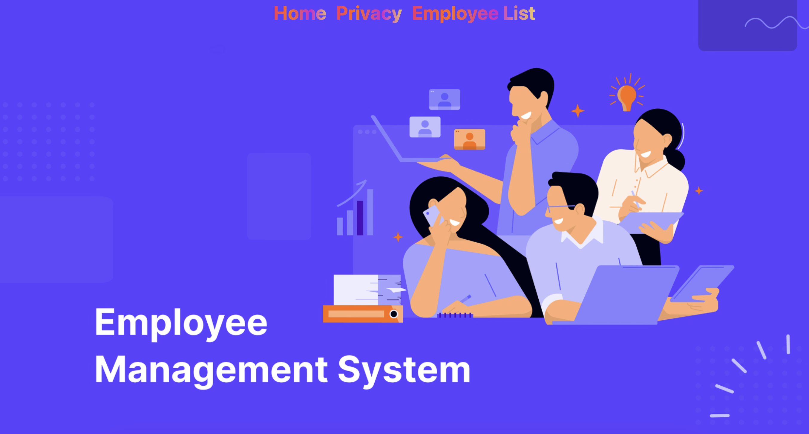
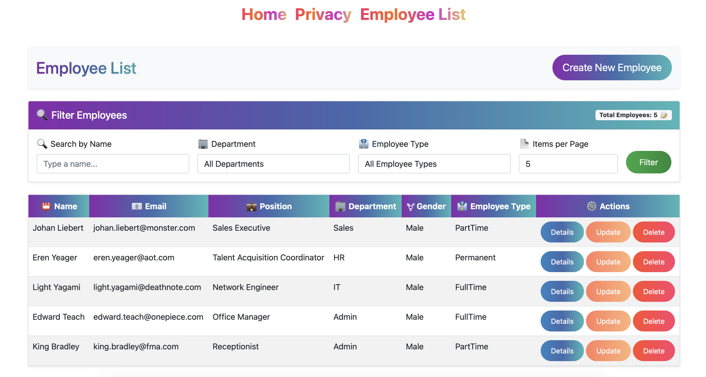
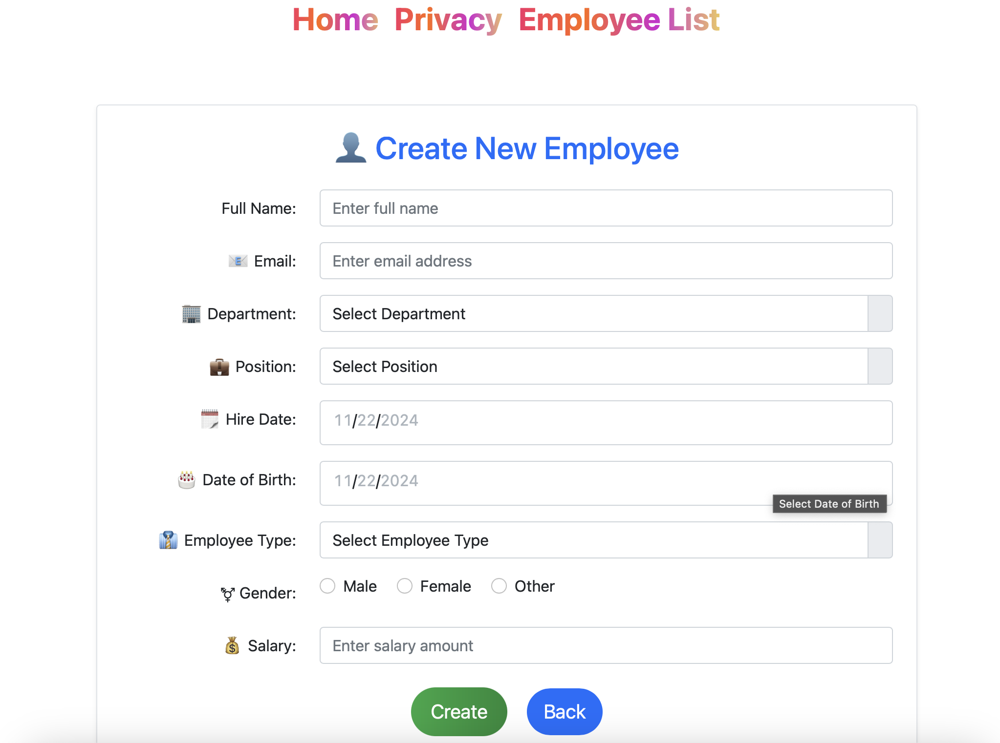
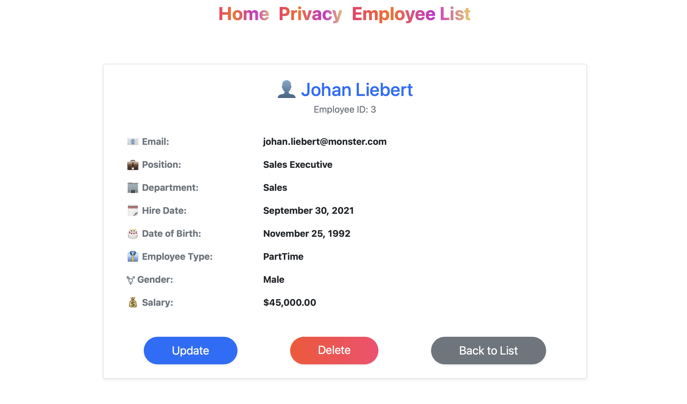
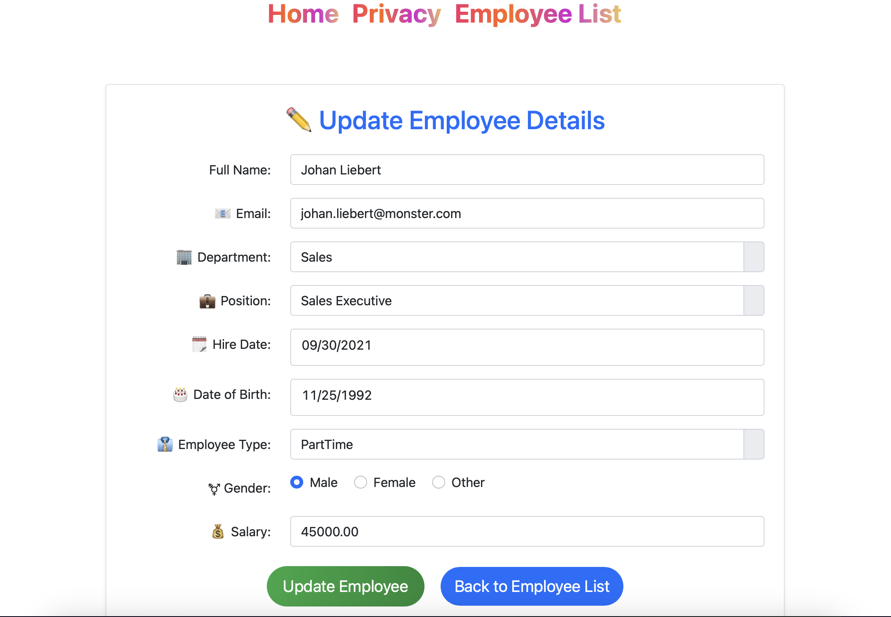
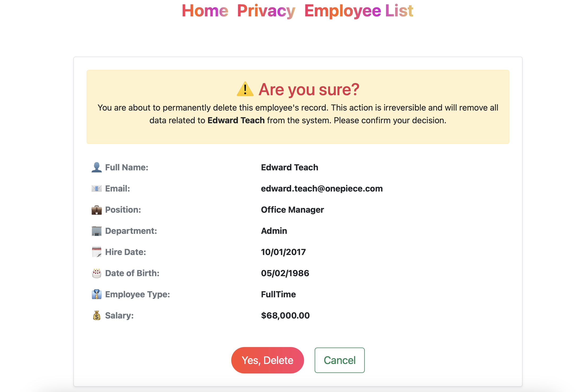

# Employee Management MVC

Employee-Management-MVC is a web application built using **ASP.NET MVC** and **MySQL**. It allows users to manage employee records efficiently, including functionalities for creating, updating, viewing details, and deleting employee entries.

## Features
- **Create**: Add new employee records with essential details.
- **Read**: View a list of employees and their individual details.
- **Update**: Edit the existing employee records.
- **Delete**: Remove employee records.

## Technologies Used
- **ASP.NET MVC**: Framework for building web applications with a clean separation of concerns.
- **MySQL**: Database management system to store employee records.
- **HTML/CSS/JavaScript**: For the frontend layout and interactivity.
- **Bootstrap**: To make the application responsive and user-friendly.

## Screenshots

Here are some screenshots of the application:

### Home Page


### List of Employees


### Create Employee


### Employee Details



### Update Employee


### Delete Employee


## Installation

To run the **Employee-Management-MVC** project locally:

1. **Clone the repository**:
   ```bash
   git clone https://github.com/Worldwiin/Employee-Management-MVC.git
